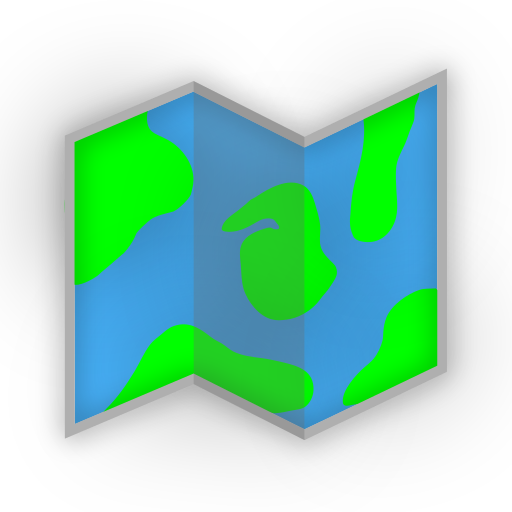

<div align="center">

  
  <h1>Voyage</h1>
  
  <p>
    The ultimate travel companion for the modern-day explorer.
  </p>

  <p>
    <strong>A fork of <a href="https://github.com/seanmorley15/AdventureLog">AdventureLog</a> by Sean Morley.</strong>
  </p>
</div>

<br />

<!-- Table of Contents -->

# Table of Contents

- [About the Project](#-about-the-project)
  - [Screenshots](#-screenshots)
  - [Tech Stack](#-tech-stack)
  - [Features](#-features)
- [Roadmap](#-roadmap)
- [Contributing](#-contributing)
  - [Translation](#-translation)
- [License](#-license)
- [Contact](#-contact)
- [Acknowledgements](#-acknowledgements)

<!-- About the Project -->

## ⭐ About the Project

> **Voyage is a fork of [AdventureLog](https://github.com/seanmorley15/AdventureLog)**, the open-source travel companion created by [Sean Morley](https://seanmorley.com). This fork builds on top of AdventureLog's foundation to make additional changes and improvements.

Starting from a simple idea of tracking travel locations, Voyage is a full-fledged travel companion. With Voyage, you can log your adventures, keep track of where you've been on the world map, plan your next trip collaboratively, and share your experiences with friends and family.

Voyage aims to be simple, beautiful, and open to everyone — inheriting AdventureLog's commitment to being a modern, open-source, user-friendly alternative to overly complex or expensive travel apps.

<!-- Screenshots -->

### 📷 Screenshots

<div align="center"> 
  
  <p>Displays the locations you have visited and the ones you plan to embark on. You can also filter and sort the locations.</p>
  
  <p>Shows specific details about a location, including the name, date, location, and description.</p>
  
  
  <p>View all of your locations on a map, with the ability to filter by visit status and add new ones by click on the map</p>
  
  <p>View a 3D representation of your locations and activities on the map, allowing for a more immersive exploration of your travel history.</p>
  
  <p>Displays a summary of your world travel stats and your most recently updated collections.</p>
  
  <p>Plan your adventures with a timeline-style itinerary planner. Each day shows numbered stops, compact transportation connectors between locations, and inline controls for adding places. Drag-and-drop reordering, day-level actions, and multiple views help you build the perfect trip.</p>
  
  <p>Lists all the countries you have visited and plan to visit, with the ability to filter by visit status.</p>
  
  <p>Displays the regions for a specific country, includes a map view to visually select regions.</p>
</div>

<!-- TechStack -->

### 🚀 Tech Stack

<details>
  <summary>Client</summary>
  <ul>
    <li><a href="https://svelte.dev/">SvelteKit</a></li>
    <li><a href="https://tailwindcss.com/">TailwindCSS</a></li>
    <li><a href="https://daisyui.com/">DaisyUI</a></li>
    <li><a href="https://github.com/dimfeld/svelte-maplibre/">Svelte MapLibre</a></li>
  </ul>
</details>

<details>
  <summary>Server</summary>
  <ul>
    <li><a href="https://www.djangoproject.com/">Django</a></li>
    <li><a href="https://postgis.net/">PostGIS</a></li>
    <li><a href="https://www.django-rest-framework.org/">Django REST Framework</a></li>
    <li><a href="https://allauth.org/">AllAuth</a></li>
  </ul>
</details>
<!-- Features -->

### 🎯 Features

- **Track Your Adventures** 🌍: Log your adventures and keep track of where you've been on the world map.
  - Locations can store a variety of information, including the location, date, and description.
  - Locations can be sorted into custom categories for easy organization.
  - Locations can be marked as private or public, allowing you to share your adventures with friends and family.
  - Keep track of the countries and regions you've visited with the world travel book.
  - Upload trails and activities to your locations to remember your experiences with detailed maps and stats.
- **Plan Your Next Trip** 📃: Take the guesswork out of planning your next adventure with an easy-to-use itinerary planner.
  - Itineraries can be created for any number of days and can include multiple destinations.
  - A timeline-style day view shows ordered stops with numbered markers and compact location cards (no image banners) for a dense overview. Lodging placement follows directional rules: on check-in day lodging appears after the last stop, on check-out day it appears before the first stop, and on days with no locations a single lodging card is shown (or two cards when a checkout and checkin are different lodgings). Lodging cards use the same compact style (no image header) as location cards within the itinerary.
  - Connector rows between adjacent items display distance and travel time powered by [OSRM](https://project-osrm.org/) routing (walking if ≤ 20 min, driving otherwise), with automatic haversine fallback when OSRM is unavailable. Self-hosted OSRM instances are supported via the `OSRM_BASE_URL` environment variable. Transportation items appear as compact cards (same style as location cards — no image banners) showing mode, duration, and distance; connector routing uses the transportation's origin coordinates when approaching and destination coordinates when departing. Boundary transitions between lodging and adjacent stops are also shown as connector rows.
  - Each day has a single `+ Add` control to insert new places, and day-level quick actions include Auto-fill and Optimize. Optimize performs nearest-neighbor stop ordering for coordinate-backed stops and keeps non-coordinate items at the end in their original relative order. The day date pill also shows a weather temperature summary (Open-Meteo based, with graceful unavailable fallback). Lodging added from within a day is automatically scheduled to that day.
  - Itineraries include many planning features like flight information, notes, checklists, and links to external resources.
  - Itineraries can be shared with friends and family for collaborative planning.
- **Share Your Experiences** 📸: Share your adventures with friends and family and collaborate on trips together.
  - Locations and itineraries can be shared via a public link or directly with other Voyage users.
  - Collaborators can view and edit shared itineraries (collections), making planning a breeze.
- **Customizable Themes** 🎨: Choose from 10 built-in themes including Light, Dark, Dim, Night, Forest, Aqua, Catppuccin Mocha, Aesthetic Light, Aesthetic Dark, and Northern Lights. Theme selection persists across sessions.

### AI Chat (Collections Recommendations)

Voyage includes an AI-powered travel chat assistant embedded in the Collections → Recommendations view. The chat uses LLM providers configured by the user (API keys set in Settings) and supports conversational trip planning within the context of a collection.

- **Provider catalog**: The backend dynamically lists all supported LLM providers via `GET /api/chat/providers/`, sourced from LiteLLM's runtime provider list plus custom entries.
- **Supported providers include**: OpenAI, Anthropic, Google Gemini, Ollama, Groq, Mistral, GitHub Models, OpenRouter, and OpenCode Zen.
- **OpenCode Zen**: An OpenAI-compatible provider (`opencode_zen`) routed through `https://opencode.ai/zen/v1`.
- **Configuration**: Users add API keys for their chosen provider in Settings → API Keys. No server-side environment variables required for chat providers — all keys are per-user.

### Travel Agent (MCP)

Voyage provides an authenticated Travel Agent MCP endpoint for programmatic itinerary workflows (list collections, inspect itinerary details, create items, reorder timelines). See the guide: [`documentation/docs/guides/travel_agent.md`](documentation/docs/guides/travel_agent.md).

- Default MCP path: `api/mcp`
- Override MCP path with env var: `DJANGO_MCP_ENDPOINT`
- Get token from authenticated session: `GET /auth/mcp-token/` and use header `Authorization: Token <token>`

<!-- Roadmap -->

## 🧭 Roadmap

The Voyage Roadmap can be found in [GitHub Issues](https://github.com/Alex-Wiesner/voyage/issues)

<!-- Contributing -->

## 👋 Contributing

<a href="https://github.com/Alex-Wiesner/voyage/graphs/contributors">
  
</a>

Contributions are always welcome!

See `contributing.md` for ways to get started.

### Pre-upgrade backup

Before upgrading Voyage or running migrations, export a collections backup snapshot:

```bash
docker compose exec server python manage.py export_collections_backup
```

Optional custom output path:

```bash
docker compose exec server python manage.py export_collections_backup --output /code/backups/collections_backup_pre_upgrade.json
```

This command exports `Collection` and `CollectionItineraryItem` data with timestamp and counts.

### Translation

Voyage is available on [Weblate](https://hosted.weblate.org/projects/voyage/). If you would like to help translate Voyage into your language, please visit the link and contribute!

<a href="https://hosted.weblate.org/engage/voyage/">

</a>

<!-- License -->

## 📃 License

Distributed under the GNU General Public License v3.0. See `LICENSE` for more information.

<!-- Contact -->

## 🤝 Contact

Sean Morley - [website](https://seanmorley.com)

Hi! I'm Sean, the creator of Voyage. I'm a college student and software developer with a passion for travel and adventure. I created Voyage to help people like me document their adventures and plan new ones effortlessly. As a student, I am always looking for more opportunities to learn and grow, so feel free to reach out via the contact on my website if you would like to collaborate or chat!

<!-- Acknowledgments -->

## 💎 Acknowledgements

- **[AdventureLog](https://github.com/seanmorley15/AdventureLog)** — the original project this fork is based on, created by [Sean Morley](https://seanmorley.com)
- Logo Design by [nordtektiger](https://github.com/nordtektiger)
- WorldTravel Dataset [dr5hn/countries-states-cities-database](https://github.com/dr5hn/countries-states-cities-database)

### Top Supporters 💖

- Veymax
- [nebriv](https://github.com/nebriv)
- [Miguel Cruz](https://github.com/Tokynet)
- [Victor Butler](https://x.com/victor_butler)
